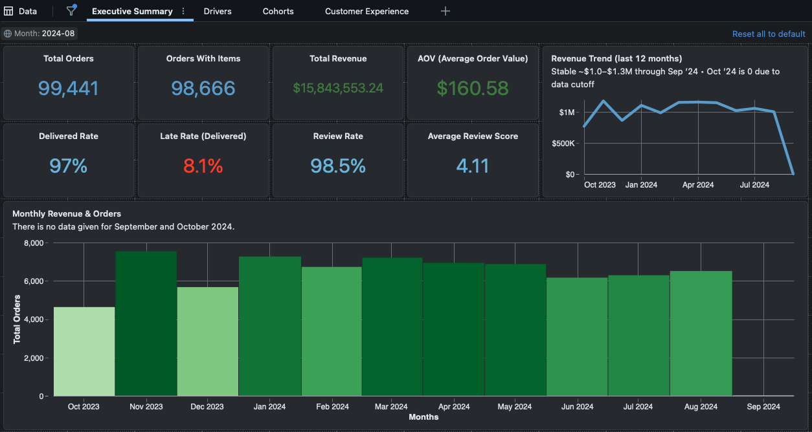
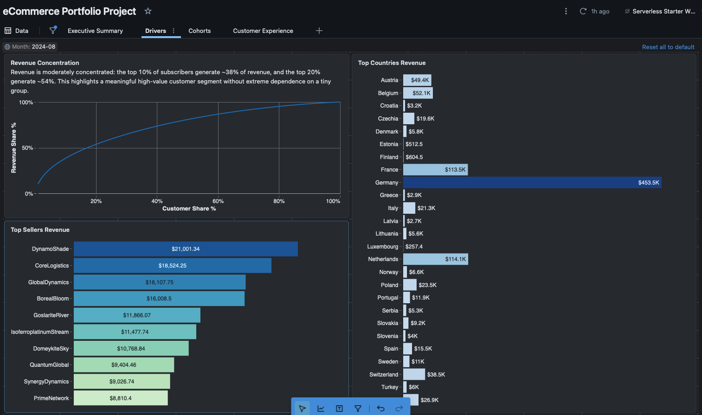
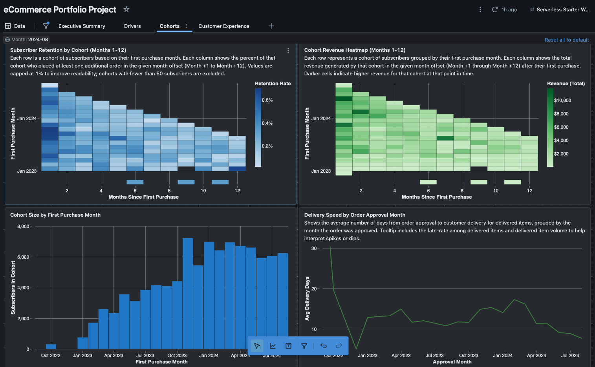
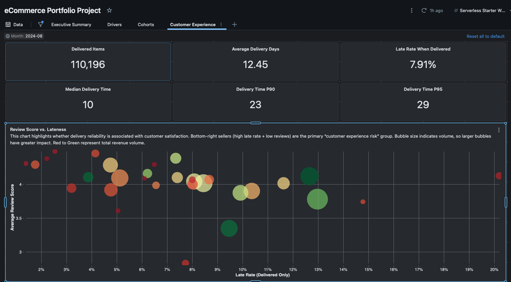

# E-Commerce Analytics Dashboard (Databricks SQL)

A 4-page analytics dashboard built in Databricks SQL to evaluate business performance, key drivers, customer cohorts, and customer delivery experience.

## Tableau Public (Interactive)
Tableau Dashboard (Drivers + Geo):
https://public.tableau.com/app/profile/cameron.scott3127/viz/E-CommerceDriversDashboard/Dashboard1?publish=yes

**Note:** The Tableau workbook includes a **Geo Analysis** dashboard. Use the in-dashboard navigation button to switch from the Drivers view to Geo.

## Screenshots

### Page 1 — Executive Summary & Trends

### Page 2 — Drivers

### Page 3 — Cohorts

### Page 4 — Customer Experience

Additional screenshots are available in `docs/screenshots/`.

## What this project demonstrates
- Data modeling mindset (raw → staging → mart)
- KPI design with guardrails (active-month filtering to avoid “ghost months”)
- Customer analytics (new vs returning, cohorts/retention)
- Operational/customer experience analytics (delivery speed percentiles, late-rate drivers)
- Clear communication (dashboard explainer PDF + documented SQL)

## Dashboard pages (what each answers)
**Page 1 — Executive Summary & Trends**
- How are revenue, orders, AOV, delivery health, and customer mix trending?

**Page 2 — Drivers (Month-filtered)**
- Which categories, sellers, payment methods, and geographies drive results in a selected month?

**Page 3 — Cohorts**
- How do subscriber cohorts retain and generate revenue over Months +1 to +12?

**Page 4 — Customer Experience Deep Dive**
- How long delivery takes (P50/P90/P95), how often deliveries are late, and which sellers/regions most contribute to late delivery and weaker review signals.

## What I discovered from my analysis
- **Customer revenue concentration is meaningful:** a relatively small subset of subscribers drives a disproportionate share of revenue, making retention and high-value customer experience key levers.
- **Late delivery is not evenly distributed:** delays tend to cluster among specific sellers and/or pockets of geography, suggesting targeted operational improvements beat broad changes.
- **Percentiles explain the real delivery experience:** averages hide the long tail—P90/P95 delivery times are the best “customer pain” indicators for reliability expectations.
- **Month-level rates need volume context:** late-rate spikes can appear in very low-volume months; applying active-month and volume guardrails prevents misleading interpretations.
- **Drivers shift over time:** top sellers, categories, and payment mix change by month, which supports using monthly slicing for diagnosis and planning (not just overall totals).

## Key build decisions
- **New vs Returning fix:** Classified using stable `subscriber_id` (not a per-order id) to avoid mislabeling all orders as “new.”
- **Ghost-month handling:** Filtered to active months (months with real revenue/orders) to prevent tail-month nulls/zeros from distorting trends.
- **Customer experience framing:** Separated “speed” (delivery days percentiles) from “reliability” (late rate among delivered).

## Artifacts
- **Dashboard explainer (PDF):** `docs/Ecommerce_Dashboard_Overview.pdf`
- Dashboard screenshots: `docs/screenshots/`
- **SQL used for dashboard tiles:** [`sql/`](sql/) (see `sql/README.md` for the index)

## Tech stack
- Databricks SQL (Unity Catalog)
- Curated mart schema: `workspace.ecom_mart`

## Data notes
This project uses a sample e-commerce dataset. Raw data is not included in this repository.
I do not publish client or employer datasets. Additional sample projects using anonymized/synthetic data are in progress.
